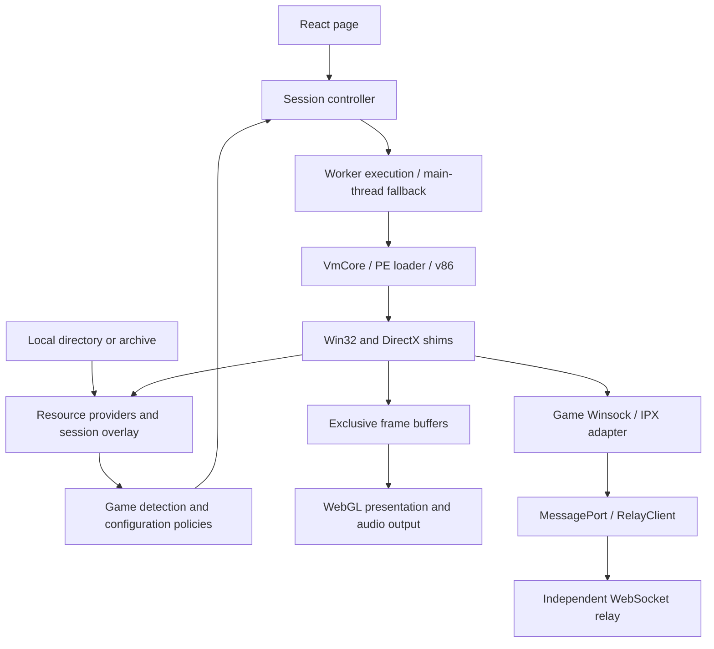

# Architecture

Design and refactoring must follow [Architecture requirements](ARCHITECTURE_REQUIREMENTS.md). This guide describes current modules and execution data flow.

RA2 VM executes original x86 programs inside the browser using v86. Custom firmware, a PE loader, and Win32/DirectX compatibility layers supply the environment required by the games. It does not boot Windows or rewrite game rules. RA2 and YR use their own version-validated executables and policies. The generic WebSocket relay is an independent workspace package.

## Execution and data flow

Players select resources before the application detects bootable games. A single complete target starts automatically; multiple targets require player selection. Game-specific configuration is constructed at the main-thread and Worker composition roots. Cross-thread communication carries only data, ports, and buffers with explicit ownership handoff, never closures or shared guest memory.

## Module boundaries

| Module                        | Responsibility                                                              | Boundary                                                                         |
| ----------------------------- | --------------------------------------------------------------------------- | -------------------------------------------------------------------------------- |
| `src/resources/`              | File contracts, providers, overlays, completeness detection                 | No browser-storage or VM dependency                                              |
| `src/platform/browser/files/` | Directory access, HTTP, IndexedDB                                           | No game-version or guest-ABI decisions                                           |
| `src/games/`                  | Game manifests, ABI, resource policies, version patches, network adaptation | Fixed game addresses belong only here                                            |
| `src/vm86/`                   | Firmware, PE, Win32/DirectX mechanisms                                      | No game, browser, or UI dependency                                               |
| `src/utils/`                  | Generic hashing, asynchronous tasks, archive extraction                     | No dependency on other src business modules; no session or game-policy ownership |
| `src/adapter/`                | VM execution adaptation, Worker bridges, audio adaptation                   | Game behavior is injected through configuration                                  |
| `src/app/session/`            | Session startup, replacement, failure, and destruction                      | Owns VM and surrounding-task lifecycles                                          |
| `src/graphics/`               | Frame presentation, scheduling, and buffer release                          | Does not alter guest simulation speed                                            |
| `src/ui/`                     | One React tree, user interaction, status presentation                       | Frequent data stays out of React state                                           |
| `packages/relay/`             | Generic binary protocol, client, server                                     | No game/application imports                                                      |

`games/vmConfiguration.ts` registers runtime factories for the selected game. RA2/YR explicitly reuse `games/shared/vmConfiguration.ts`, which composes resource policies and shim factories. `games/source.ts` describes target games and file sources. `VmCore` consumes injected capabilities without selecting extension caches or import ABI by game name.

Callers of pure providers import the relevant module directly, avoiding barrel imports that bring in browser code and the entire shim. `utils` contains only foundational capabilities without game policies; callers import individual files, with no barrel entry point. Independence from a particular game does not imply utility ownership: frame caches belong to presentation, resource prefetching depends on provider contracts, and audio has a platform lifecycle.

Generic extraction lives in `utils/archive/`: ZIP reading, 7z/rar extraction, NSIS parsing, LZMA, and their Workers. Extraction tasks own Worker cancellation and destruction. Third-party code, licenses, and attribution stay with the module. Game allowlists, startup-layer partitioning, and YR base-resource dependencies live in `games/archivePolicy.ts`. Adapter loading entry points execute the layered plan. Serializable `directoryRules` inject taunt-audio placement rules shared by browser and CI.

Windows path normalization lives in `utils/windowsPath.ts` and is reused by guest path entry points. `utils/memoryDiff.ts` only compares byte snapshots; adapter retains recording state and cross-thread result contracts.

Assign responsibilities by reason for change: game formats, resource precedence, and compatibility rules belong to `games`; VM/host connectivity belongs to `adapter`; session startup and destruction belong to `app/session`. Composition entry points may reference concrete implementations but must not define game rules themselves. New games must register their own policies and factories, with no implicit RA2/YR fallback.

The session lifecycle interface in `app/session/runtime.ts` requires only startup and destruction. The controller preserves the caller's concrete type without depending on adapter input, debug, or map interfaces. Status/event contracts live in `app/session/runtimeEvents.ts`; adapter and UI import them directly, without a reverse dependency from sessions to adapter.

## Resources and persistence

`platform/browser/files/sessionFiles.ts` owns the browser implementation for extracted files and IndexedDB writeback. `adapter/gameZip.ts` selects parsers and composes results; it no longer defines persistence providers. Pure memory providers remain in `resources/providers/memory.ts`.

File interfaces distinguish unknown, missing, zero-byte, and failed reads. A visible directory entry does not imply its bytes have been extracted. Reads pending background work wait for the provider instead of pretending the file is missing. Range reads preserve actual lengths and offsets.

Runtime settings do not overwrite original game files, executables, or cross-session caches. INI and save writes go into a session overlay with priority over original sources. Static files may reuse snapshots; writable INI/SAV content is reread according to policy. Replacing a provider invalidates affected caches. Zero-byte files participate in save/restore and must not disappear during cache cleanup.

The OLE shim serializes native `IPersistStream` objects through reusable guest callback slots. Save, load, and registered class creation share the scheduler-aware callback lifetime; per-object code allocation would exhaust the dynamic stub arena. Structured storage uses the project's `SGBYSTG1` container, with stream data followed by length-prefixed property metadata. This is not the Windows compound-file format. Older containers without metadata remain parseable, but RA2 saves produced while native object serialization was disabled omit game state and cannot be repaired into complete saves. RA2 enables native serialization; YR retains its previous campaign policy until separately validated. Asset-free persistence regressions execute actual x86 callbacks and reopen serialized metadata in a fresh shim.

Archives split startup-required and background data to reduce initial wait time; background extraction failures still must be reported. Saving succeeds only after the IndexedDB transaction completes. Quota exhaustion cannot be reported as a restorable cache. Exclusive copies returned by cache backends may be handed off; guest WASM memory and shared executable caches must never be transferred. These contracts are covered by provider, archive-layer, and cache tests listed in [Testing](TESTING.md).

## Guest compatibility and version policies

The PE loader parses images/imports. Import stubs dispatch guest calls to shims, clean arguments according to each game's ABI, and return. Unimplemented calls must not default to success. Games may share generic mechanisms, but version addresses, signatures, and patches belong separately to RA2/YR. Write patches only after every target signature passes. Unknown versions retain original behavior or explicitly reject unsupported features.

Startup-page and direct-battlefield entry use one-shot guest hooks while retaining native initialization. Multiplayer startup sets an initial target from the room speed; subsequent performance reports, Timing, synchronization windows, and acknowledgments are handled by the original program. Never bypass game logic using fabricated input, acknowledgments, or clocks. Version-specific evidence lives in source, behavioral tests, [Launch behavior](RA2_COMMAND_LINE_AND_SPAWNER.md), and [Network reliability](RA2_NETWORK_RELIABILITY.md); this architecture guide does not duplicate address inventories.

RA2 and YR remain separate engines. A single gamemd loading original RA2 resources is not a supported promise. Such conversion involves game logic and patches; filename mapping alone does not establish compatibility. Local guards do not prove upstream defects fully resolved: for example, `repairRa2InvalidRepairRate` corrects only nonpositive or nonfinite RepairRate values and cannot cover all custom rules.

## Scheduling, presentation, and ownership

Worker execution is one guest path; main-thread fallback uses identical game policies and file semantics. `platform/browser/emulator.ts` wraps v86 browser adaptation. When the upstream interface matches, Workers use an in-thread MessageChannel scheduler while retaining original positive-wait durations. Otherwise, upstream scheduling remains in place. The main thread keeps its own scheduler. Adaptation does not change the guest clock or PIT frequency.

DirectDraw boundaries produce frames, and exclusive frame buffers pass to presentation. The presenter selects the newest frame and coalesces browser drawing. Simulation FPS, submitted-frame FPS, and rAF FPS are distinct metrics; discarding obsolete visuals must not change simulation results. Controllers own audio, input, WebGL objects, and frequent messages, without propagating them frame by frame through React state. Experimental upscaling loads lazily through development entry points; production entry points do not load ORT or experimental model Workers.

The session controller handles normal exit, reopening, and failure cleanup. Worker termination also closes network proxies and ports. Timers, listeners, pending RPCs, and buffers all have disposal paths. Queued callbacks become invalid after destruction; asynchronous results must not revive old sessions or overwrite new ones. See [Worker](WORKER.md) and [React boundaries](REACT_UI.md).

## Multiplayer and the independent relay

Game layers convert Winsock/IPX datagrams to virtual addresses and ports. The relay routes binary datagrams by room without interpreting game events, units, or resources. Rooms derive from URL paths; address selection and game metadata belong to callers. Main-thread `RelayClient` owns the WebSocket; Workers send/receive through a dedicated MessagePort.

The port bridge combines already-pending data and acknowledges batches. WebSocket retains each game datagram's message boundary; batching adds no waiting timer. Port ACKs reclaim bridge capacity only. WebSocket backlog is still checked before actual sending. Limit violations and connection closure retain session-termination semantics, with no automatic reconnect, replay of old commands, or match resumption.

`relay-package/client` does not load the Node server; the server does not depend on browsers. The package maintains the sole [wire protocol](../packages/relay/RELAY_PROTOCOL.md) and builds/deploys independently. The application supplies game adaptation; the generic package supplies connections, heartbeats, rate limiting, backpressure, and close cleanup.

`packages/relay/src/network/relayWire.ts` is the current multiplayer wire format. `src/vm86/shim/dplayWire.ts` defines a separate DirectPlay session/player protocol, carried by `dplayTransport` only when the guest creates a DirectPlay session. Its browser default still uses the historical `/game` path, which Vite serves as local game resources rather than a relay endpoint. These protocols have different types, codecs, and semantics; do not merge them or reuse each other's frames. The relay package independently owns `relayWire` byte layout, and the generic shim does not depend on it.

## Verification design

`tests/basic/architecture/dependencies.test.ts` automatically checks dependency boundaries. Pure logic and synthetic VM tests do not read game assets. Instruction fixtures verify ABI and patch behavior inside real v86. Separate real-game tests use hash-validated assets to verify native startup, frames, player state, and command execution on both clients.

Public CI and asset-enabled CI are separate: the former accepts contribution checks in isolated environments, while the latter runs reviewed code only. Performance conclusions use native frame counters and measured time in the same scenario. Target FPS, microbenchmarks, and passing short matches cannot establish long-match stability. See [Testing](TESTING.md) and [Real-game CI](REAL_GAME_CI.md) for entry points and requirements.
