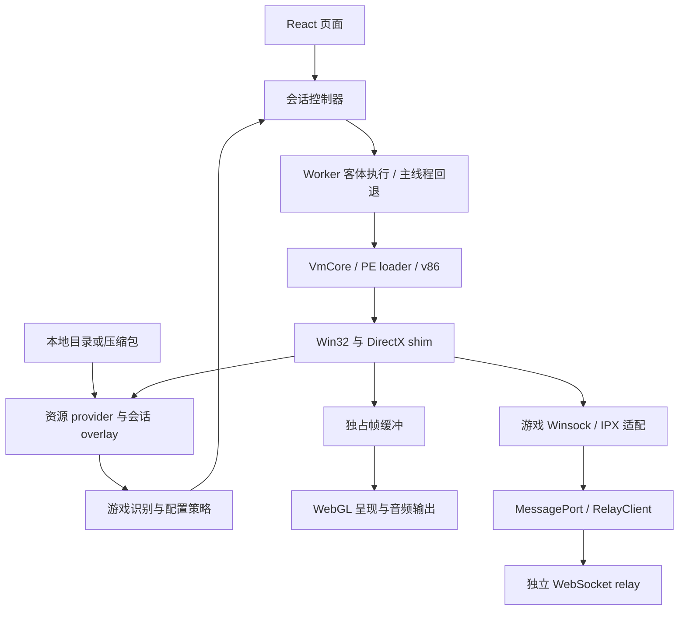

# 架构设计

设计与重构须遵循 [架构要求](ARCHITECTURE_REQUIREMENTS.md)；本文描述当前模块与执行数据流。

RA2 VM 在浏览器内通过 v86 执行原版 x86 程序，以自定义固件、PE loader 和
Win32/DirectX 兼容层提供游戏需要的运行环境。它不启动 Windows，也不重写游戏规则。
RA2 与 YR 使用各自受版本校验的程序和策略；通用 WebSocket relay 独立为 workspace 包。

## 执行与数据流

资源先由玩家选择，再识别可启动的游戏。只有一个完整目标时自动启动，多个目标时
由玩家选择。游戏专属配置在主线程和 Worker 各自的组合根生成，跨线程只传递数据、
端口和明确移交所有权的缓冲，不传闭包或共享客体内存。

## 模块边界

| 模块                          | 职责                                        | 边界                                          |
| ----------------------------- | ------------------------------------------- | --------------------------------------------- |
| `src/resources/`              | 文件契约、provider、overlay、完整性识别     | 不依赖浏览器存储和 VM                         |
| `src/platform/browser/files/` | 目录访问、HTTP、IndexedDB                   | 不决定游戏版本或客体 ABI                      |
| `src/games/`                  | 游戏清单、ABI、资源策略、版本补丁、网络适配 | 固定游戏地址只能在此处                        |
| `src/vm86/`                   | 固件、PE、Win32/DirectX 机制                | 不依赖游戏、浏览器或 UI                       |
| `src/utils/`                  | 通用摘要、异步任务、归档解压                | 不依赖其他 src 业务模块；不持有会话或游戏策略 |
| `src/adapter/`                | VM 执行适配、Worker 桥与音频适配            | 通过配置注入游戏行为                          |
| `src/app/session/`            | 会话启动、替换、失败与销毁                  | 拥有 VM 和外围任务生命周期                    |
| `src/graphics/`               | 帧呈现、调度和缓冲释放                      | 不修改客体逻辑速度                            |
| `src/ui/`                     | 单一 React 树、用户交互和状态展示           | 高频数据不进入 React state                    |
| `packages/relay/`             | 通用二进制协议、client、server              | 不导入游戏或应用模块                          |

`games/vmConfiguration.ts` 按所选游戏登记运行时工厂，RA2/YR 显式复用
`games/shared/vmConfiguration.ts`，后者组装资源策略与 shim 工厂；`games/source.ts` 描述目标游戏和
文件来源。`VmCore` 消费注入的能力，不按游戏名决定扩展名缓存或导入 ABI。
纯 provider 的调用方直接导入相应模块，不通过大聚合入口拉入浏览器和整个 shim。
`utils` 仅承载不含业务策略的基础能力，调用方直接导入具体文件，不设聚合入口。
与具体游戏无关不代表属于工具层：帧缓存有呈现所有权，资源预取依赖 provider 契约，
音频有平台生命周期，仍按对应领域组织。
通用解压集中在 `utils/archive/`：包含 ZIP 读取、7z/rar 提取、NSIS 解析、LZMA 及其 Worker，
提取任务拥有 Worker 的取消与销毁；第三方代码及许可说明随模块保留。
游戏白名单、启动层划分和 YR 基础资源依赖集中在 `games/archivePolicy.ts`；
adapter 加载入口只执行分层计划。嘲讽语音归位通过可序列化的 `directoryRules` 注入，
浏览器和 CI 共用规则。
Windows 路径折叠位于 `utils/windowsPath.ts`，客体路径入口沿用其实现。
`utils/memoryDiff.ts` 只比较字节快照；录制状态和跨线程结果契约仍由 adapter 拥有。

职责以变化原因划分：游戏格式、资源优先级和兼容规则变化归 `games`；VM 与宿主的
连接方式变化归 `adapter`；会话启动和销毁流程变化归 `app/session`。组合入口可以引用
具体实现，但不自行定义游戏规则。新增游戏需要登记自己的策略和工厂，不能隐式回退到 RA2/YR。

会话生命周期接口定义在 `app/session/runtime.ts`，仅要求启动和销毁；控制器保留调用方
具体类型，但不依赖 adapter 的输入、调试和地图接口。状态与事件契约位于
`app/session/runtimeEvents.ts`，adapter 和 UI 直接引用，会话层不反向导入 adapter。

## 资源与持久化

`platform/browser/files/sessionFiles.ts` 持有解包文件与 IndexedDB 写回的浏览器实现；
`adapter/gameZip.ts` 负责选择解析器并组装结果，不再定义持久化 provider。
纯内存 provider 仍位于 `resources/providers/memory.ts`。

文件接口区分未知、缺失、零字节和读取失败。目录清单可见不代表字节已经解压；
后台尚未完成的读取等待 provider，不能伪装成缺文件。范围读取保留实际长度与偏移。

原始游戏文件、主程序和跨会话缓存不被运行设置覆盖。INI 与存档写入会话 overlay，
优先于原始来源。静态文件可复用快照，INI/SAV 等可写内容按策略重新读取；更换 provider
会使相关缓存失效。零字节文件参与保存和恢复，不能在缓存整理时丢弃。

压缩包分为启动所需数据和后台数据，减少首屏等待；后台解压失败仍必须上报。
IndexedDB 事务完成后才能认为保存成功，配额不足不能报告可恢复。缓存后端返回的
独占副本可以移交，客体 WASM 内存与共享 EXE 缓存不能 transfer。
详细接口和性能边界见 [资源性能](PERFORMANCE_RESOURCES.md)。

## 客体兼容与版本策略

PE loader 解析映像和导入，导入桩把客体调用交给 shim，按各游戏 ABI 清理参数并返回。
未实现的调用不能默认成功。游戏可以复用通用机制，但版本地址、签名和补丁分别属于
RA2/YR；所有目标签名通过后才写入补丁，未知版本保留原行为或明确拒绝不受支持的功能。

启动页和战场直达使用一次性客体 hook，仍执行原生初始化。联机起步按房间档位设置目标，
后续性能报告、Timing、同步窗口和确认由原版处理。不通过伪造输入、确认或时钟跳过游戏逻辑。
具体版本证据分别放在源码、行为测试及 [启动说明](RA2_COMMAND_LINE_AND_SPAWNER.md)、
[联机说明](RA2_NETWORK_RELIABILITY.md)，架构文档不复制固定地址清单。

RA2 与 YR 保持两个引擎，不承诺用单个 gamemd 加载原版 RA2 资源。此类转换牵涉游戏
逻辑与补丁，不能仅靠文件名映射视为兼容。局部保护也不等于已根治上游错误：例如
`repairRa2InvalidRepairRate` 只修正非正或非有限的 RepairRate，不能覆盖所有自定义规则。

## 调度、呈现与所有权

Worker 是客体执行路径之一；主线程回退使用相同游戏策略和文件语义。
`platform/browser/emulator.ts` 封装 v86 的浏览器适配。Worker 在上游接口匹配时使用
本线程 MessageChannel 调度，正等待保留原时长；接口不匹配则沿用上游实现。
主线程保留其调度方式。适配不改变客体时钟或 PIT 频率。

DirectDraw 边界产生画面，独占帧缓冲交给呈现层；呈现层选择最新帧并合并浏览器绘制。
逻辑 FPS、画面提交 FPS 与 rAF FPS 是不同指标，丢弃过时画面不能改变游戏模拟结果。
音频、输入、WebGL 对象和高频消息由控制器持有，不通过 React state 逐帧传播。
实验超分从开发入口延迟加载，生产入口不加载 ORT 或实验模型 Worker。

会话控制器负责正常退出、重开和失败清理。Worker 终止时同时关闭网络代理与端口；
计时器、监听、待处理 RPC 和缓冲都有销毁路径。已经排队的回调在销毁后失效，
异步结果不能复活旧会话或覆盖新会话。详情见 [Worker](WORKER.md) 和
[React 边界](REACT_UI.md)。

## 联机与独立 relay

游戏层把 Winsock/IPX 数据报转换成虚拟地址和端口；relay 只按房间路由二进制数据报，
不理解游戏事件、单位或资源。房间来自 URL 路径，地址选择和游戏元数据属于调用方。
主线程 `RelayClient` 持有 WebSocket，Worker 经专用 MessagePort 收发。

端口桥合并已经待发的数据并按批确认；WebSocket 仍保留每个游戏数据报的消息边界，
不为凑批增加计时等待。端口 ACK 只回收桥接额度，真正发送前还检查 WS 积压。
超限或连接关闭沿用会话终止语义；不自动重连、回放旧命令或提供断线续局。

`relay-package/client` 不加载 Node 服务端，server 不依赖浏览器。包内维护唯一的
[线协议](../packages/relay/RELAY_PROTOCOL.md)，可以独立构建和部署。应用提供游戏适配，
通用包提供连接、心跳、限流、背压及关闭清理。

线协议只此一处：`packages/relay/src/network/relayWire.ts` 是当前联机路径，
`src/vm86/shim/dplayWire.ts` 是另一套 DirectPlay 会话/玩家消息，只在客体自己
创建 DirectPlay 会话时经 `dplayTransport` 承载，其浏览器默认目标仍是历史
`/game` 路径（Vite 用该前缀提供本机游戏资源，不是 relay 端点）。
两套消息的类型、编解码与语义不同，不能合并或互相复用帧格式；`relayWire`
的字节布局由 relay 包独立维护，通用 shim 不依赖它。

## 验证设计

依赖边界由 `tests/basic/architecture/dependencies.test.ts` 自动检查。纯逻辑与合成 VM
测试不读取游戏资源，指令夹具在真实 v86 中验证 ABI 和补丁行为。真实游戏测试另使用
受哈希校验的素材，验证原生启动、画面、玩家状态及双端命令执行。

公共 CI 与有素材 CI 分离；前者接受隔离环境中的贡献检查，后者只运行已审查代码。
性能结论使用相同场景的原生帧计数和实测时间，不把目标 FPS、微基准或短局通过当作
长局稳定性。入口和准入条件见 [测试指南](TESTING.md) 与 [CI 配置](REAL_GAME_CI.md)。
